<table border="0" cellpadding="0" cellspacing="0" width="100%">
  <tr>
    <td valign="middle">
      <video src="golden-gate-traffic.mp4" width="100%" autoplay loop muted playsinline style="border-radius: 6px;"></video>
    </td>
    <td align="right" valign="middle" style="padding-left: 15px;" width="165">
      
    </td>
  </tr>
</table>

<br/>

<table border="0" cellpadding="0" cellspacing="0" width="100%">
  <tr>
    <td width="90" valign="top">
      
    </td>
    <td valign="top" style="padding-left: 20px;">
      <h1 align="left">Bhavya Goyal</h1>
      <p align="left"><strong>Full Stack & Web3 Developer</strong> • Building the internet I want to use.</p>
    </td>
  </tr>
</table>

<br/>

* ⚡ AI, Web3, and developer tools keep me curious.
* 🚀 I optimize for learning, shipping, and compounding.
* 🛠 Currently building **Planora** and experimenting with workspace event SaaS platforms.

<br/>

<div align="center">
  
</div>

<p align="center">
  
  &nbsp;
  <a href="https://wakatime.com/@Bhavyag-dev"></a>
</p>

<p align="center">
  <a href="mailto:gbhavyawork@gmail.com"></a>
  <a href="https://www.linkedin.com/in/bhavyagoyal1/"></a>
  <a href="https://github.com/Bhavyag-dev"></a>
  <a href="https://x.com/Bhavyaztwt"></a>
  <a href="https://cal.com/bhavya-goyal/30min"></a>
</p>

---

## 🧬 `> whoami`

```js
const bhavya = {
  name        : "BHAVYA",
  role        : "Full-Stack Developer",
  stack       : ["MongoDB", "Express.js", "React.js", "Node.js"],
  passions    : ["Clean Code", "Scalable Systems", "Great UX"],
  currentFocus: "Building production-grade MERN apps",
  funFact     : "I refactor my code more than I sleep 😅",
  available   : true, // ← Open to collaborate!
};
```

---

## 💻 Tech Stack

<a href="https://skillicons.dev">
  
</a>

<br/>
<br/>

<p align="center">
  <a href="https://reactnative.dev/" target="_blank" rel="noreferrer">
    
  </a>
  <a href="https://reactrouter.com/" target="_blank" rel="noreferrer">
    
  </a>
  <a href="https://nodemon.io/" target="_blank" rel="noreferrer">
    
  </a>
  <a href="https://ejs.co/" target="_blank" rel="noreferrer">
    
  </a>
  <a href="https://streamlit.io/" target="_blank" rel="noreferrer">
    
  </a>
  <a href="https://numpy.org/" target="_blank" rel="noreferrer">
    
  </a>
</p>

<p align="center">
  <a href="https://pandas.pydata.org/" target="_blank" rel="noreferrer">
    
  </a>
  <a href="https://matplotlib.org/" target="_blank" rel="noreferrer">
    
  </a>
  <a href="https://www.adobe.com/products/photoshop.html" target="_blank" rel="noreferrer">
    
  </a>
  <a href="https://www.adobe.com/products/photoshop-lightroom.html" target="_blank" rel="noreferrer">
    
  </a>
</p>

<p align="center">
  <a href="https://www.adobe.com/products/photoshop-lightroom-classic.html" target="_blank" rel="noreferrer">
    
  </a>
  <a href="https://www.framer.com/" target="_blank" rel="noreferrer">
    
  </a>
  <a href="https://www.canva.com/" target="_blank" rel="noreferrer">
    
  </a>
  <a href="https://powerbi.microsoft.com/" target="_blank" rel="noreferrer">
    
  </a>
  <a href="https://www.cisco.com/" target="_blank" rel="noreferrer">
    
  </a>
</p>

<p align="center">
  <a href="https://learn.microsoft.com/en-us/windows/terminal/" target="_blank" rel="noreferrer">
    
  </a>
  <a href="https://www.gnu.org/software/bash/" target="_blank" rel="noreferrer">
    
  </a>
  <a href="https://www.vultr.com/" target="_blank" rel="noreferrer">
    
  </a>
  <a href="https://www.openapis.org/" target="_blank" rel="noreferrer">
    
  </a>
</p>

---

## 📊 GitHub Command Center

<div align="center">
  
  
</div>

<div align="center">
  
</div>

<div align="center">
  
</div>

---

## 🏆 Achievements

<div align="center">
  
</div>

---

<div align="center">

### 💬 Dev Quote of the Day


</div>

---

<div align="center">

```
"First, solve the problem. Then, write the code." — John Johnson
```

**⭐ Drop a star if you vibe with my work — it means the world!**


</div>
